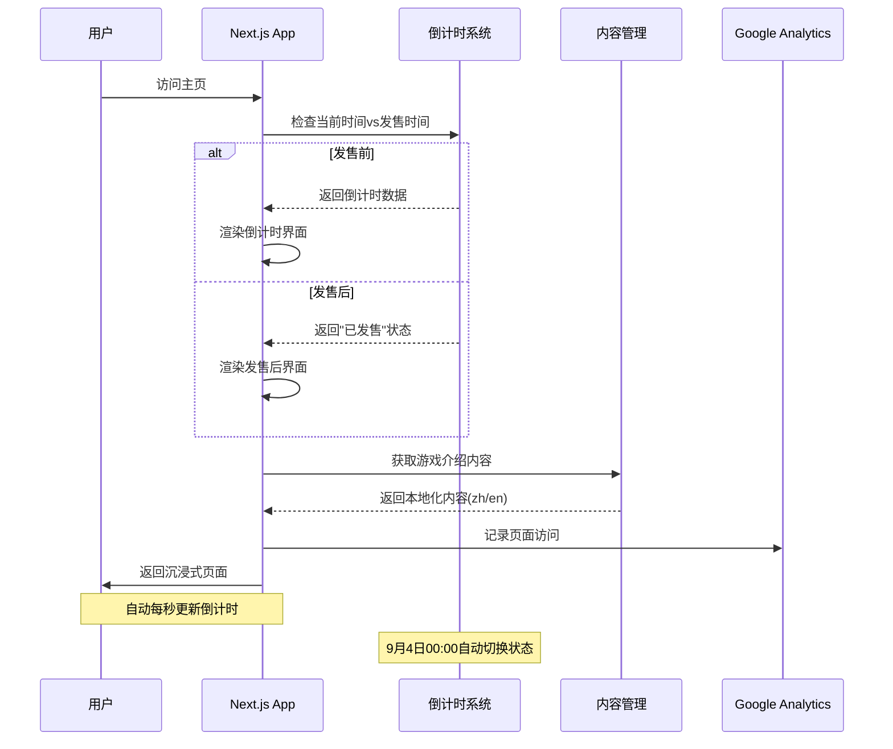
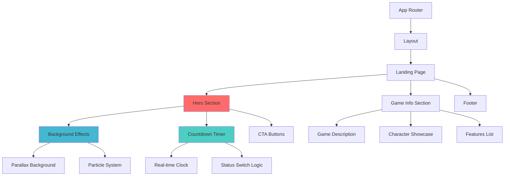
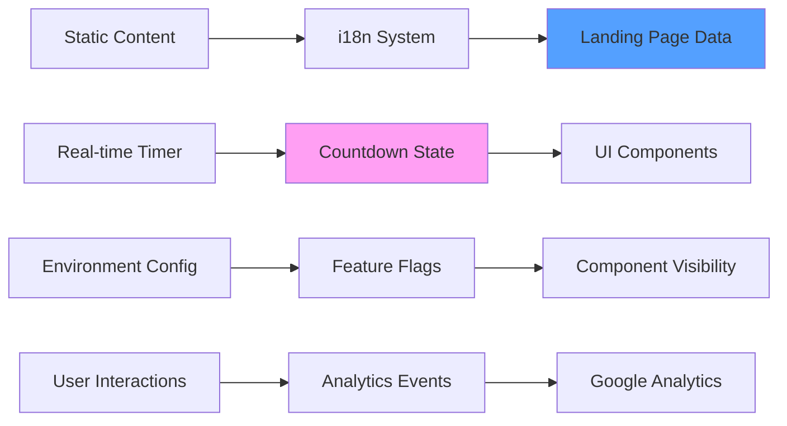
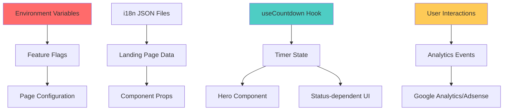

# 《空洞骑士：丝之歌》官方资讯社区 - 产品需求文档

## 版本更新记录

### 版本1.1 (2025-09-04) - 游戏定价信息页面
**新增功能:**
- 🎮 官方定价信息表格展示
- 🌍 多平台多地区价格对比（部分平台未定价）
- 🔗 官方商店购买链接
- 📊 静态数据展示（放弃汇率转换）

**原型设计:**
```
+---------------------------------------------------------+
|               《空洞骑士：丝之歌》官方定价               |
+-----------------+---------+---------+---------+---------+
| 国家/地区       | Steam   | PS      | Xbox    | Switch  |
+-----------------+---------+---------+---------+---------+
| 美国            | $19.99  | 未定价   | 未定价   | 未定价   |
| 欧洲            | €19.99  | 未定价   | 未定价   | 未定价   |
| 日本            | ¥2,300  | 未定价   | 未定价   | 未定价   |
+-----------------+---------+---------+---------+---------+
| 数据来源: 官方商店页面 | 最后更新: 2025-09-04 |
+---------------------------------------------------------+
| [前往Steam购买] [PlayStation] [Xbox] [Switch]          |
+---------------------------------------------------------+
```

### 版本1.0 (2025-09-03) - 紧急发售日版本
- 发售倒计时系统
- 沉浸式视觉体验
- 游戏内容展示
- 基础基础设施

## 产品概述

### 核心目标 (Mission)
打造《空洞骑士：丝之歌》的首选中文资讯社区，为等待游戏发售的粉丝提供最及时、最深度的游戏资讯和攻略内容。

### 用户画像 (Persona)
**主要用户：** 《空洞骑士》忠实粉丝和《丝之歌》期待者
- **年龄：** 18-35岁游戏爱好者  
- **核心痛点：**
  - 官方信息更新缓慢且分散在各平台
  - 缺乏中文优质内容聚合
  - 对丝之歌发售信息极度渴望
  - 需要重温空洞骑士内容来准备新作

### 商业模式
免费社区 + Google Adsense广告变现

## MVP版本 (V1.0) - 紧急发售日版本

### 选定原型: 沉浸式体验版
```
┌─────────────────────────────────────┐
│            🌟 视差背景效果             │
│                                     │
│         丝之歌 LOGO                  │
│       (半透明毛玻璃效果)             │
│                                     │
│    ⭐ 明天正式发售 ⭐                 │
│      [XX:XX:XX]                    │
│                                     │
│   [🎮 立即购买]  [📺 预告片]        │
│                                     │
│ ────────────────────────────────── │
│                                     │
│  "踏上Hornet的冒险之旅..."           │
│   (简洁的游戏介绍)                   │
│                                     │
│  📰 最新 | 🎯 攻略 | 🗺️ 工具        │
└─────────────────────────────────────┘
```

### 核心功能清单
1. **发售倒计时系统**
   - 精确到秒的实时倒计时
   - 发售日自动状态切换
   - 时区自适应

2. **沉浸式视觉体验**
   - 丝之歌主色调: `oklch(0.5323 0.1865 28.1976)`
   - 视差背景效果
   - 毛玻璃风格卡片
   - 微妙粒子动画

3. **游戏内容展示**
   - 基于官网的游戏介绍
   - Hornet角色特色
   - 游戏核心卖点
   - 官方购买链接

4. **基础设施**
   - 响应式设计 (移动优先)
   - 中英文多语言
   - SEO基础优化
   - Google Analytics集成

## 架构设计蓝图

### 核心流程图

#### 1. 用户访问和发售状态检测流程


#### 2. 组件渲染和交互流程


#### 3. 数据流和状态管理


### 组件交互说明

#### 现有文件修改清单

**核心配置文件：**
```
src/app/theme.css                    # 主题色彩和CSS变量
├─ 新增丝之歌主色调
├─ 深色主题优化  
└─ 动画和特效样式

src/i18n/pages/landing/zh.json       # 中文内容
├─ 替换所有ShipAny相关内容
├─ 添加丝之歌游戏介绍
└─ 英雄区文案和CTA按钮

src/i18n/pages/landing/en.json       # 英文内容
└─ 英文版游戏内容翻译
```

**页面和布局：**
```
src/app/[locale]/(default)/page.tsx  # 主页面
├─ 简化为发售日专版
├─ 移除不需要的sections
└─ 添加countdown组件引用

src/app/layout.tsx                   # 全局布局
├─ 更新meta信息
├─ 添加丝之歌SEO数据
└─ Google Adsense配置
```

#### 新增组件架构

**倒计时系统：**
```
src/components/countdown/
├─ index.tsx              # 主倒计时组件
├─ hooks/
│  └─ useCountdown.ts     # 倒计时逻辑Hook
└─ types.ts               # 类型定义

组件依赖关系：
useCountdown.ts → index.tsx → Hero Section → Landing Page
```

**视觉效果系统：**
```
src/components/effects/
├─ parallax-background.tsx     # 视差背景
├─ particle-system.tsx         # 丝线粒子效果
├─ glass-card.tsx             # 毛玻璃卡片
└─ animations.ts              # Framer Motion动画配置

调用关系：
animations.ts → 各效果组件 → Hero/GameInfo组件
```

**增强的Hero区域：**
```
src/components/blocks/hero/
├─ index.tsx                   # 主Hero组件 (修改)
├─ countdown-hero.tsx          # 发售日专版Hero
├─ bg.tsx                      # 背景效果 (修改)  
└─ silksong-theme.tsx          # 丝之歌主题样式
```

#### 组件间数据流



### 技术选型与风险分析

#### 关键技术选型

**1. 动画和视觉效果**
```typescript
技术选择: Framer Motion + CSS Animations + Canvas API
原因: 
- Framer Motion: 已集成，提供流畅的React动画
- CSS Animations: 性能优秀，适合背景效果
- Canvas API: 粒子系统，可控制性能

替代方案: GSAP (更强大但增加bundle size)
```

**2. 倒计时系统**
```typescript
技术选择: 自定义React Hook + Date对象
原因:
- 精确到秒的实时更新
- 自动处理时区问题
- 轻量级，无第三方依赖

关键实现:
const useCountdown = (targetDate: string) => {
  const [timeLeft, setTimeLeft] = useState(calculateTimeLeft());
  // 每秒更新，自动切换发售状态
}
```

**3. 响应式设计**
```typescript
技术选择: Tailwind CSS + 自定义断点
原因:
- 移动优先设计
- 现有项目已集成
- 维护成本低

断点策略:
- 移动端: 简化动画效果
- 桌面端: 完整视觉体验
```

#### 潜在技术风险与缓解策略

**风险1: 性能问题**
```
问题: 视觉效果过多导致低端设备卡顿
缓解策略:
1. 渐进增强: 移动端简化效果
2. 懒加载: 非关键动画延迟加载
3. 性能监控: Core Web Vitals指标跟踪
4. 降级方案: 检测设备性能自动调整
```

**风险2: 时间同步问题**
```
问题: 用户本地时间不准确影响倒计时
缓解策略:
1. 服务器时间校准: API获取服务器时间
2. 时区处理: 自动检测用户时区
3. 容错机制: 发售日当天强制显示"已发售"
4. 手动切换: 管理员可强制切换状态
```

**风险3: 内容和SEO风险**
```
问题: 发售日内容切换影响SEO
缓解策略:
1. 预渲染: 静态生成发售前后两个版本
2. 结构化数据: 添加游戏相关的Schema.org标记
3. 渐进式内容: 核心信息保持稳定
4. 重定向规划: 发售后引导用户到攻略内容
```

**风险4: 流量冲击**
```
问题: 发售日流量激增导致服务不稳定
缓解策略:
1. 静态化: 尽可能使用静态生成
2. CDN缓存: Vercel Edge Network分发
3. 图片优化: Next.js Image组件优化加载
4. 监控预警: 实时性能监控
```

#### 实施优先级和技术债务

**Phase 1 (今天): 核心功能**
- ✅ 基础倒计时器 (无复杂动画)
- ✅ 主题色彩更新
- ✅ 内容替换
- ✅ 响应式布局

**Phase 2 (本周): 增强体验**
- 🔄 视觉效果 (渐进增强)
- 🔄 性能优化
- 🔄 SEO完善
- 🔄 分析集成

**技术债务管理:**
```
1. 暂时硬编码发售时间 → 后续改为CMS配置
2. 简化动画效果 → 后续添加高级动画选项
3. 单语言优先 → 后续完善英文版本
4. 基础SEO → 后续添加结构化数据
```

## 技术栈

### 现有技术栈
- **框架:** Next.js 15 + TypeScript
- **样式:** Tailwind CSS + Shadcn UI
- **动画:** Framer Motion
- **数据库:** PostgreSQL + Drizzle ORM
- **认证:** NextAuth.js (暂时禁用)
- **国际化:** next-intl
- **部署:** Vercel

### 新增技术组件
- **倒计时系统:** 自定义React Hook
- **视觉效果:** CSS Animations + Canvas API
- **主题系统:** 丝之歌色彩主题
- **广告集成:** Google Adsense

## 未来版本规划

### V1.0 (已上线)
**核心功能列表：**
1. **发售倒计时系统**
   - 精确到秒的实时倒计时
   - 发售日自动状态切换
   - 时区自适应

2. **沉浸式视觉体验**
   - 丝之歌主色调应用
   - 视差背景效果
   - 毛玻璃风格卡片
   - 微妙粒子动画

3. **游戏内容展示**
   - 基于官网的游戏介绍
   - Hornet角色特色
   - 游戏核心卖点
   - 官方购买链接

4. **基础设施**
   - 响应式设计 (移动优先)
   - 中英文多语言
   - SEO基础优化
   - Google Analytics集成

### V1.1 (当前开发中)
**游戏定价信息页面：**
- 多平台官方定价表格展示（Steam、PlayStation、Xbox、Switch）
- 主要地区价格对比（美国、欧洲、日本、英国）
- 官方商店购买链接跳转
- 静态数据展示，手动更新机制
- 最后更新时间显示

### V2.0 (发售后2-3个月)
- 用户注册和登录系统
- 用户评论和讨论功能
- 丝之歌攻略工具开发
- 进度追踪器

### V3.0+ (未来版本)
- 社区投稿功能
- 高级工具（地图标注、魅力计算器等）
- 移动APP开发
- 多语言扩展（英文版）

## 关键业务逻辑 (Business Rules)
1. **内容管理：** 管理员发布，访客浏览
2. **更新频率：** 每周至少1篇优质内容
3. **广告策略：** Google自动广告，不影响用户体验
4. **SEO策略：** 针对"丝之歌"、"空洞骑士"等关键词优化

## 数据契约 (Data Contract)
**V1.1版本新增数据结构：**
- **定价信息 (Pricing):** 
  - 平台: Steam、PlayStation、Xbox、Switch
  - 地区: 美国、欧洲、日本、英国  
  - 价格: 当地货币金额或null（未定价）
  - 购买链接: 官方商店URL
  - 最后更新时间: 数据更新时间戳

**MVP版本需要的数据结构：**
- **文章 (Posts):** 标题、内容、分类、发布时间、封面图
- **分类 (Categories):** 资讯、攻略、讨论、官方消息
- **媒体文件:** 图片、视频链接
- **SEO数据:** meta信息、关键词、描述

## 实施时间线

**V1.0 (2025-09-03) - 紧急上线:** 
- ✅ 核心功能开发
- ✅ 视觉主题应用
- ✅ 内容替换和本地化
- ✅ 倒计时功能实现

**V1.1 (2025-09-04) - 游戏定价信息:**
- 🔄 定价数据JSON结构设计
- 🔄 游戏定价表格组件开发
- 🔄 购买链接组件实现
- 🔄 定价页面路由创建
- 🔄 导航菜单更新

**后续优化:**
- 🔄 性能优化和测试
- 🔄 SEO和分析集成
- 🔄 社交分享功能
- 🔄 高级视觉效果

---

**文档版本:** 1.1  
**创建日期:** 2025年9月3日  
**最后更新:** 2025年9月4日
**项目状态:** 已批准，实施中
**负责人:** 产品设计师 + 开发团队

---

## 官网内容摘要 (基于 https://hollowknightsilksong.com/)

### 游戏核心信息
- **标题:** Hollow Knight: Silksong
- **开发商:** Team Cherry (澳大利亚阿德莱德3人工作室)
- **主角:** Hornet，一位"致命的猎手"，被俘获并带到神秘王国

### 游戏特色
- **杂技动作玩法**
- **200多种独特敌人**
- **互联的2D世界，手工绘制艺术风格**
- **Hornet必须"与敌人战斗，寻找盟友，解开谜团"**
- **Christopher Larkin创作的充满活力的管弦乐配乐**

### 游戏亮点
- **探索多样环境:** "苔藓石窟、珊瑚森林和闪亮城堡"
- **掌握新战斗动作和"丝绸般的能力"**
- **揭开Hornet被俘背后的谜团**

### 平台支持
- Steam
- GOG
- Humble Bundle
- PlayStation 4/5
- Xbox Game Pass
- Nintendo Switch

### 独特卖点
- **令人惊叹的手绘2D艺术**
- **精复杂的世界设计**
- **关于Hornet旅程的复杂叙事**
- **挑战性战斗系统**

---

**注：** 该PRD基于2025年9月3日的紧急需求制定，游戏将于2025年9月4日发售。